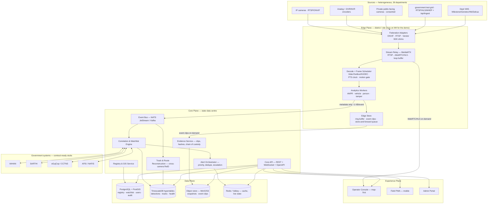

# Sentinel Platform — Master Solution Plan
### Gujarat Police Innovation Challenge 2026 — Unified CCTV Integration & Video Analytics Platform

| | |
|---|---|
| **Product name** | **Sentinel Platform**. ⚠️ *Note: this is also the organisers' programme name. In the PPT and HLD, always write "the Sentinel Platform" for the product and "the Challenge" / "the government test grid" for the organisers' assets, so a judge is never confused about what is yours.* |
| **Entrant** | Solo individual, registering under **Category 1 — Student / Researcher / Professional** |
| **Chosen architecture** | **Hybrid: Model 1 + Model 2 + Model 3 + selective Model 4** (registry/GIS + unified viewing + vendor federation + event-driven central recording) |
| **Target** | Win — build for Phase-2 production credibility from day one |
| **Demo hardware** | Apple Silicon M4 (local), M2 (secondary). Colab GPU for any fine-tuning. No AWS at demo time; AWS/K8s is the *documented* production path. |
| **Delivery surfaces** | Operator Console (desktop web) + Field PWA (mobile) + Admin Portal — one design system, three shells |
| **Source code** | **Private repository.** Submitted as a hosted archive/private link, not a public GitHub URL. See §9. |
| **Face recognition** | **Out of scope by decision.** Vehicle-centric analytics only; the privacy position is argued positively. See §6. |
| **Documents** | This master plan → [01-ARCHITECTURE](./01-ARCHITECTURE.md) · [02-ANPR-PIPELINE](./02-ANPR-PIPELINE.md) · [03-UX-DESIGN](./03-UX-DESIGN.md) · [04-SCALE-PLAN](./04-SCALE-PLAN.md) · [05-DELIVERY-PLAN](./05-DELIVERY-PLAN.md) · [06-SUBMISSION-PLAYBOOK](./06-SUBMISSION-PLAYBOOK.md) |

---

## 1. The strategic read — what actually wins this

This is not judged as a hackathon demo. It is judged as a **procurement shortlist**. Seven scored areas, all mandatory, and bonus points only count once every mandatory box is ticked. So the plan is built backwards from the rubric.

| # | Scored area | What the jury is really asking | How Sentinel answers it |
|---|---|---|---|
| 1 | Successful Test Case | "Can you onboard our ~50 heterogeneous feeds and *actually* analyse them?" | Catalogue-driven auto-onboarding from `/api/ingest`; all ~50 cameras live in the registry in <60 s; continuous ANPR on the analytics-enabled subset with tiered scheduling |
| 2 | Solution Presentation | "Do you understand our problem, or did you bring a generic VMS?" | Model justification grounded in *their* four challenges + bandwidth/cost math that proves why full centralisation fails |
| 3 | Solution Architecture | "Is this deployable in a government network without a rip-and-replace?" | Edge-first, vendor-neutral adapter framework, ONVIF-first, mTLS, department tenancy, zero changes to existing dept VMS |
| 4 | Working Platform + Demo | "Is this real software or a Figma file?" | One-command `docker compose up`, real backend, real DB, real streams, no mocked UI states; source archive + guided code tour supplied to reviewers |
| 5 | Video Analytics Output | "Is your ANPR good enough to trust on evidence?" | Multi-stage ANPR + temporal voting + confidence scoring + exportable evidence report (CSV/PDF with snapshots, plate, camera, GPS, PTS-accurate timestamp) |
| 6 | Scalability + PoC Readiness | "Show me the 80,000-camera number, not the word 'scalable'." | Quantified tiering, GPU sizing, bandwidth math, storage tiers, phased district rollout, capex/opex in ₹ |
| 7 | Submission Completeness | "Is everything accessible and consistent?" | Submission playbook with link-verification in incognito, consistent naming across PPT/HLD/videos/repo |

**Bonus magnets we deliberately build** (the official bonus list, one-to-one):
cross-camera vehicle re-identification + GIS route reconstruction · working alert prioritisation with triage workflow · analytics beyond ANPR (vehicle class/colour, person, intrusion/loitering, camera-tamper) · low-bandwidth metadata-only degradation mode · privacy masking, hash-chained audit trail, RBAC/ABAC · camera health & ops dashboard · integration-ready REST APIs with contract stubs for VAHAN / SARTHI / eGujCop / AFIS.

### 1.1 The three moments that win the room

Everything else is table stakes. Rehearse these three:

1. **The BOLO moment.** Judge reads out a vehicle number on evaluation day. You type it into one box. The system **simultaneously** (a) retro-searches every event ever ingested and (b) arms a forward-looking watchlist rule. Within seconds the map draws the vehicle's timestamped route across cameras, with snapshot evidence at each hop, and new sightings start landing live as alerts. One input, two directions in time.
2. **The unreadable-plate moment.** A plate the OCR can't fully resolve. You show fuzzy/partial matching (`GJ01?B12?4`), OCR-ambiguity classes (0↔O, 1↔I, 8↔B, 5↔S, 2↔Z), and appearance-based vehicle re-identification bridging the gap — then a spatio-temporal feasibility check that rejects physically impossible hops. This is the difference between a toy and a forensic tool.
3. **The honesty moment.** A slide that says: *"Centralising 80,000 cameras costs 160 Gbps of backbone and 12.1 PB of hot storage for a single week. We do not propose that. Here is the edge-first design that runs on ~140 Mbps — about 1/1,100th of the bandwidth — and here is exactly where the video does and does not travel."* Juries fund people who show them the number they were afraid to ask about.

---

## 2. Architecture decision — why this hybrid

> **Rule from the organisers:** Model 1 is mandatory for everyone and insufficient alone. Hybrid is explicitly allowed and bonus-worthy.

**Sentinel = Model 1 (foundation) + Model 2 (default integration path) + Model 3 (federation where a VMS exists) + Model 4-selective (event-driven central recording, not bulk archival).**

| Model | How we implement it | Why |
|---|---|---|
| **1 — Registry & GIS** *(mandatory)* | Central camera inventory, PostGIS geometry, MapLibre GIS console, bulk CSV + manual + API onboarding, health monitoring, coverage gap analysis, dept-wise RBAC, full audit | Mandatory, and it is the cheapest high-scoring component. It is also the *system of record* every other subsystem reads from. |
| **2 — Unified viewing + metadata analytics** | Direct RTSP/ONVIF pull → local relay → WebRTC/HLS to browser. Dept systems untouched. Metadata (not video) flows to the centre. | This is the realistic path for the ~50 test feeds and for the majority of the 80k. Lowest infra, highest demo reliability. |
| **3 — VMS federation middleware** | Adapter/plugin framework with a stable `CameraSource` contract: ONVIF Profile-S/T, generic RTSP, and stub-but-real adapters for Milestone / Genetec / Hikvision / Dahua patterns. One normalised downstream API. | This is what actually unblocks 26 departments. Working adapter *framework* + 2 live adapters proves extensibility without needing 26 vendor licences. |
| **4 — Central VMS** *(selective)* | **Event-driven recording**: continuous short-loop buffer at the edge; on an event/alert, the pre/post-roll clip is sealed, hashed, and pushed to central object storage as forensic evidence. Plus continuous recording for a **designated small set** of high-value cameras, with timeline scrubbing playback. | Gives you the full Model-4 user experience (record, playback, scrub, export, chain-of-custody) and the DR/tiering story, **without** claiming a 12 PB/week archive you cannot build. This is the defensible version of "we do Model 4 too". |

**Architecture Decision Records** (full ADRs with rejected alternatives live in [01-ARCHITECTURE §2](./01-ARCHITECTURE.md)):

- **ADR-001** Edge-first analytics, metadata-to-centre — *rejected:* central decode of all streams (160 Gbps).
- **ADR-002** Event-driven + selective continuous recording — *rejected:* statewide 24×7 central archive (12.1 PB/7-day hot tier).
- **ADR-003** Adapter/plugin federation over per-vendor forks — *rejected:* one monolith per VMS vendor.
- **ADR-004** Python everywhere for services, TypeScript for UI, off-the-shelf Go binaries (MediaMTX, NATS) we never fork — *rejected:* polyglot Go/Java services (solo dev, no second language budget).
- **ADR-005** PTS-derived time as the single source of truth, never arrival time — mandated by the organisers' integrator guide and scored.
- **ADR-006** PostgreSQL + PostGIS + TimescaleDB as one primary store; OpenSearch deferred to the scale plan — *rejected:* Elasticsearch on day one (solo ops cost, no accuracy benefit at 50 cameras).
- **ADR-007** Mobile as an installable PWA, not React Native — *rejected:* RN (build/signing overhead for a solo entrant; PWA is demo-safe and offline-capable).

---

## 3. System shape (one picture)

**The load-bearing idea:** *video stays local, meaning travels.* An ANPR event is ~1 KB of JSON plus a ~30 KB snapshot. A 1080p stream is 2 Mbps. Everything in the design follows from that ratio.

---

## 4. Technology stack (final)

Chosen for: open-source mandate · Apple Silicon demo · one-person maintainability · a straight line to the AWS/K8s production story.

| Layer | Choice | Licence | Why this, not the obvious alternative |
|---|---|---|---|
| Edge/relay | **MediaMTX** | MIT | One Go binary: RTSP in → WebRTC(WHEP)/HLS/RTSP out, plus recording & playback server. Gives us Model-2 viewing *and* Model-4 recording for free. Beats hand-rolled Janus/Ampache plumbing. |
| Decode | **FFmpeg / PyAV** with VideoToolbox (Mac) → NVDEC/DeepStream (prod) | LGPL/BSD | Hardware decode is the only way ~50 streams fit on one M4. |
| AI runtime | **ONNX Runtime** (CoreML EP on Mac, TensorRT/CUDA EP in prod) | MIT | One model artefact, three accelerators. Avoids a PyTorch-on-MPS-only dead end. |
| ANPR | `fast-alpr` + `open-image-models` + `fast-plate-ocr` (all MIT); Ultralytics YOLO (AGPL) for vehicles; vendored MIT ByteTrack — see [02-ANPR-PIPELINE](./02-ANPR-PIPELINE.md) | MIT / AGPL-3.0 | Multi-stage detector → tracker → plate → rectify → OCR → temporal vote. Licence position stated openly, with an Apache-only migration path for Phase 2. |
| Services | **Python 3.13 + FastAPI + asyncio/uvloop**, Pydantic v2 | MIT/BSD | Single language for a solo dev; the CV ecosystem is Python. Throughput risk is mitigated by process-per-camera-group workers and an off-the-shelf broker. |
| Event bus | **NATS JetStream** (Kafka-compatible abstraction retained) | Apache-2.0 | Single 20 MB binary, runs on the M4, real persistence/replay. Kafka is the documented production swap; we keep a thin `EventBus` port so it is a config change. |
| Primary DB | **PostgreSQL 17 + PostGIS + TimescaleDB** | PostgreSQL/Apache-2.0 | Registry geometry, time-series detections, and fuzzy plate search (`pg_trgm`) in one engine. |
| Search | **Postgres FTS + pg_trgm** now; **OpenSearch** in the scale plan | — | At 50 cameras, Postgres wins on ops cost with identical UX. Honest, and documented. |
| Object store | **MinIO** (local) → S3 (prod) | AGPL-3.0 / — | S3 API parity means zero code change between demo and production. |
| Cache/live state | **Valkey** (Redis fork) | BSD | Live camera state, alert dedupe windows, rate limits. |
| Frontend | **React 19 + TypeScript + Vite + Tailwind v4 + shadcn/ui (Radix) + Motion** | MIT | Accessible primitives + full styling control = the only realistic path to Apple-level polish for a backend-heavy solo dev. |
| Maps | **MapLibre GL JS + deck.gl**, OSM / Bhuvan tiles, PMTiles for offline | BSD/MIT | Vector tiles, 60 fps, genuinely beautiful. Leaflet is the stated hint but MapLibre is its open successor — note this in the PPT. |
| Video in browser | **hls.js** + native **WebRTC WHEP** client | Apache-2.0 | WHEP for the low-latency wall, HLS for firewalled networks and mobile. |
| AuthN/Z | **Keycloak** (OIDC) or self-hosted JWT + Casbin-style policy | Apache-2.0 | Department tenancy, RBAC + ABAC, SSO story for government. |
| Orchestration | **Docker Compose** (demo) → **Kubernetes/Helm** manifests (prod story) | Apache-2.0 | `docker compose up` must work first try on a judge's machine. |
| Observability | **OpenTelemetry + Prometheus + Grafana**, structured JSON logs | Apache-2.0 | Camera-health and pipeline-lag dashboards are explicitly bonus-scored. |

**What we deliberately do not build:** our own VMS recorder, our own tracker, our own OCR architecture, our own map renderer, our own auth. Every one of those is a solved open-source problem, and the jury scores integration judgement, not NIH.

---

## 5. Non-negotiable compliance with the organisers' integrator guide

These are scored directly via the official pre-submission checklist, and most failures come from ignoring them. They are baked into the ingest layer as enforced defaults, not left to discipline:

| Rule | Implementation |
|---|---|
| Force RTSP over TCP | `rtsp_transport=tcp` hard-coded in every capture path; HLS auto-fallback if 8554 is blocked. Covered by a unit test that asserts the option is set. |
| All timing from PTS, never arrival | A `StreamClock` type wraps every frame. Arrival time is **not exposed** to analytics code. Trackers/Kalman consume PTS deltas only. |
| Exponential backoff reconnect | Supervisor with 2 s → 30 s jittered backoff, per-camera circuit breaker, no tight loops. |
| Catalogue-driven discovery | Every run starts from `GET /api/ingest`; camera IDs are never hard-coded; a reconciliation job diffs catalogue vs registry and auto-onboards changes. |
| Mixed H.264/H.265, mixed resolution | Per-camera decoder config from catalogue properties; **ragged batching** (group by resolution class), never a fixed-shape batch. |
| Decode warnings at join are not fatal | Decoder errors are logged at `debug` until the first IDR; only sustained failure trips the breaker. |
| Don't trust `CAP_PROP_FPS` | Effective frame rate is *measured* from PTS in a rolling window; the declared value is recorded as metadata only. |
| Tolerate inter-frame gaps | Gap ≠ disconnect. Motion models use elapsed PTS; the breaker trips on stall duration, not on a missing frame. |
| Survive the loop cut (scene discontinuity) | Loop/cut detector (histogram + PTS regression) → resets background models, ReID galleries and track IDs cleanly, and emits a `stream.discontinuity` event that shows up in the health dashboard. |
| Consume only; never publish or call control API | Relay config is pull-only; publishing endpoints are disabled in config and asserted at startup. |
| Open only cameras you process | Lazy capture with reference counting; idle captures closed after a TTL. A live "open captures" counter is on the ops dashboard. |
| No reliance on downloaded footage | Everything is built against live capture from day one; `/stream/<id>` is never fetched as a file. |

> Turning this checklist into a visible **"Integrator Compliance" panel** in the ops dashboard (green ticks, live counters for backoff events, discontinuities, measured vs declared FPS) is a cheap and very deliberate signal to a technical jury that you read their guide.

---

## 6. Feature scope — MoSCoW

### Must (no submission without these)
- Catalogue-driven onboarding of all ~50 test cameras; bulk CSV + manual + API onboarding for the general case
- PostGIS registry + GIS map with department/type/status layers and coverage gap analysis
- Unified live viewing wall (WebRTC primary, HLS fallback) with per-tile health
- Continuous ANPR with PTS-accurate timestamps and snapshot evidence
- Watchlist DB (stolen / wanted / missing / suspect / BOLO) + continuous correlation + real-time alerts
- Vehicle search → timestamped, location-wise route on GIS + event timeline
- Alert triage workflow (acknowledge / assign / resolve / mark false positive)
- Camera health monitoring + ops dashboard
- RBAC by department + immutable audit trail
- Evidence report export (CSV + PDF) for the govt-feed demo
- One-command deploy; OpenAPI docs; reviewable source archive

### Should (these are the bonus points)
- Cross-camera vehicle ReID + spatio-temporal route validation
- Event-driven central recording + timeline playback + clip export with hash chain-of-custody
- Adapter framework with ≥2 working adapters + documented plugin SDK
- Alert prioritisation/scoring, dedupe, escalation rules
- Low-bandwidth degradation mode (metadata-only, snapshot downscale, store-and-forward)
- Privacy: bystander/face blurring by default, reveal-on-authorisation with reason capture
- Mock-but-contract-real VAHAN/SARTHI/eGujCop/AFIS connectors behind a provider interface
- Field PWA with push alerts and offline queue

### Could
- Additional analytics: helmet/triple-riding, wrong-way, intrusion/loitering, crowd density, abandoned object, camera tamper
- Natural-language search ("red hatchback near Sector 18 yesterday evening")
- Automatic gap-analysis recommendations for new camera placement

### Won't (this cycle — and say so out loud, it builds credibility)
- Real integration with production VAHAN/AFIS (no access granted; we ship the contract + a conformant mock)
- **Face recognition of any kind** — a deliberate scope decision, not a gap. Faces are *detected only in order to be blurred*. The system is vehicle-centric: it answers "where did this vehicle go", not "where did this person go". Say this proactively; it is the strongest privacy position available and it pre-empts the single most common criticism of statewide CCTV programmes.
- Statewide 24×7 central archive (deliberately rejected — see the cost model)

---

## 7. What each deliverable becomes

| Required submission | Sentinel artefact |
|---|---|
| (1) Solution Presentation | `deliverables/presentation/` — model justification, architecture, analytics, alerting, scale, policing impact |
| (2) Technical Proposal / HLD | [01-ARCHITECTURE](./01-ARCHITECTURE.md) + [04-SCALE-PLAN](./04-SCALE-PLAN.md) exported to PDF |
| (3) Demo on own feed (2–3 min) | Scripted run: onboard a self-hosted feed → live ANPR → watchlist hit → alert → GIS route. Storyboard in [06-SUBMISSION-PLAYBOOK](./06-SUBMISSION-PLAYBOOK.md) |
| (4) Demo on govt feed + output report | Overnight run across the ~50-camera grid → auto-generated plate/timestamp evidence report + screen recording |
| (5) Scale plan to ~80k | [04-SCALE-PLAN](./04-SCALE-PLAN.md) — bandwidth, GPU, storage, HA/DR, security, ₹ capex/opex, phased rollout |

---

## 8. Risk register

| Risk | Impact | Mitigation |
|---|---|---|
| M4 cannot sustain ~50 concurrent decodes + inference | Demo stalls — fatal | Tiered analytics scheduler (full-rate tier / sampled tier / registry-only tier), motion gating, hardware decode, downscaled decode, measured capacity documented honestly. Capacity benchmark is **Milestone 1**, before any feature work. |
| ANPR accuracy poor on Indian plates at CCTV angles | Kills scored area 5 | Multi-stage pipeline with rectification + temporal voting across a track; fuzzy/partial matching so a partially-read plate still finds the vehicle. **No credible pretrained Indian weights exist publicly — budget 1–2 Colab fine-tuning days up front rather than treating it as contingent.** |
| Test grid camera IDs/props change before evaluation | Silent breakage | Catalogue-driven by contract; nightly reconciliation; zero hard-coded IDs; integration test that boots from a catalogue fixture |
| Scope explosion (3 UI surfaces, solo) | Nothing finishes well | Single design system, one codebase, three shells; Should/Could features strictly gated behind Must completion; weekly demo-able increments |
| Losing time to infra yak-shaving | Lost days | Off-the-shelf binaries (MediaMTX, NATS, Postgres, MinIO) via Compose; no custom infra |
| Privacy/ethics challenge from jury | Credibility hit | Privacy-by-design section in the HLD: blurring, purpose limitation, retention policy engine, four-eyes reveal, false-match redressal, DPDP Act 2023 alignment |
| Demo-day network blocks RTSP/8554 | Demo dies live | HLS fallback path tested and rehearsed; a recorded fallback video kept ready |

---

## 9. Decisions taken

| # | Decision | Consequence for the build |
|---|---|---|
| 1 | **Category 1 — Student / Researcher / Professional** | Phase-1 pool ₹7 L; jury weights innovation and feasibility over infra muscle. No DPIIT certificate needed. |
| 2 | **Product name: "Sentinel Platform"** | Shares a name with the organisers' programme — so every document must consistently say *"the Sentinel Platform"* for the product and *"the Challenge" / "the government test grid"* for their assets. A cover slide reading "Sentinel Platform — submitted to the Sentinel Challenge" removes all ambiguity in one line. |
| 3 | **Private repository, permanently** | Submit a hosted source archive or a private link with reviewer access instead of a public GitHub URL. See the mitigation below — this one costs you points unless it is handled deliberately. |
| 4 | **No face recognition** | Simplifies the analytics plane and the privacy story. Faces are detected *only to blur them*. Milestone M13 drops FRS; the freed time goes to vehicle attributes and zone analytics. |

### Mitigating the private-repo decision

"Working Platform + Demo" is a scored area, and an open repository is a cheap, high-trust proof that working software exists. Keeping it private is legitimate, but the evidence has to come from somewhere else. Compensate deliberately:

- **Show the terminal on camera, repeatedly.** `docker compose ps`, live logs scrolling, `pytest` running green, an API call returning real JSON. Backend liveness has to be *visible* because it cannot be *inspected*.
- **Ship a source archive with the submission** (zip, or a private link with viewer access for the evaluators). The challenge asks for a repo link *optionally*; an archive plus a clear file tree satisfies the same intent.
- **Publish the artefacts, not the code:** the OpenAPI specification, the architecture docs, the accuracy benchmark CSVs, the capacity curves. These prove rigour without exposing implementation.
- **Include a `SOURCE-TOUR.md`** in the archive — a five-minute guided reading path through the codebase for a reviewer with limited time. Most private submissions are never actually read; a guided tour changes that.
- **Reconsider at submission time.** If you later decide the openness is worth more than the protection, flipping a private repo public takes one click, and the challenge explicitly mandates open-source technologies — a jury may read a closed repo as being in tension with that spirit. Worth one deliberate re-think before you upload.

---

*Next: read [01-ARCHITECTURE](./01-ARCHITECTURE.md) for component-level design and ADRs.*
