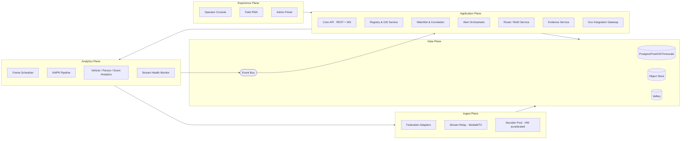
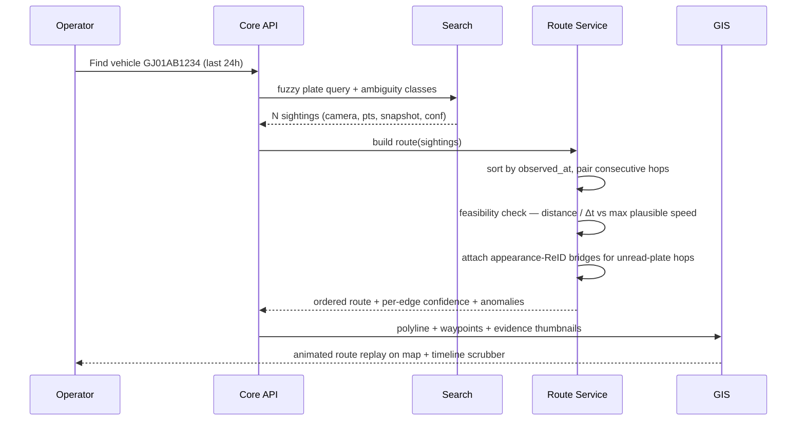
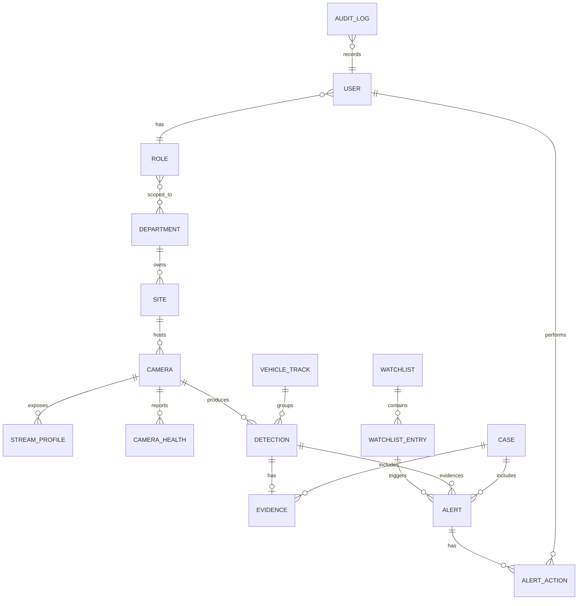
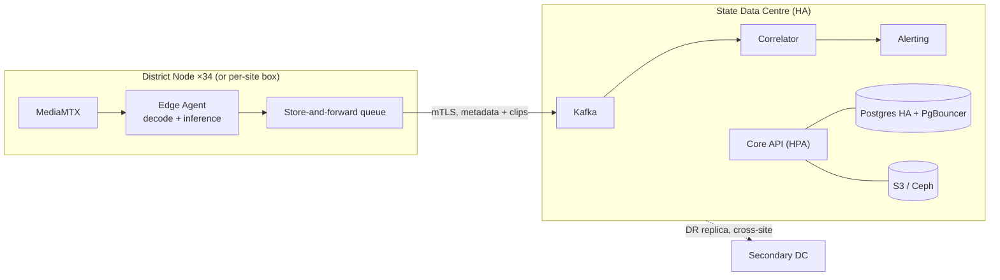

# 01 — Architecture & High-Level Design
### Sentinel · Unified CCTV Integration & Video Analytics Platform

> This document doubles as the **Technical Proposal (HLD)** deliverable. Export to PDF at submission time.

> **Implementation status (M3, this session):** Model 1 (the mandatory registry + GIS foundation) is built and verified against a real PostGIS-backed Postgres — not just designed. See [`services/core_api/src/core_api/registry/`](../services/core_api/src/core_api/registry) (`service.py`, `bulk_import.py`, `gap_analysis.py`) and [`services/core_api/src/core_api/db/models.py`](../services/core_api/src/core_api/db/models.py). Async SQLAlchemy 2.0 + GeoAlchemy2 + Alembic, with real GIST-indexed geometry columns for camera location and FOV. All ~8 synthetic-grid cameras (a proxy for the ~50-camera government grid) auto-onboard via catalogue-driven upsert and are idempotently re-onboardable (a second sync updates in place, never duplicates). Coverage gap analysis is a genuine PostGIS `ST_SquareGrid` + `ST_Distance` query, not a mocked calculation — confirmed to correctly report both "covered" and "uncovered" outcomes depending on the configured radius. 34 integration tests (skipped, not failed, when Postgres isn't running — see `services/core_api/tests/conftest.py`) plus the full unit-test tier, all green. Two real async-SQLAlchemy bugs were found and fixed while building this: `pool_pre_ping=True` triggers a documented greenlet-context error with the asyncpg driver, and an ORM object returned from a write path must have every relationship it will be read through explicitly refreshed — async sessions do not support implicit lazy-loading.

---

## 1. Design principles

1. **Video stays local, meaning travels.** Bandwidth and storage economics dictate the entire topology. A detection event is ~1 KB; a stream is 2 Mbps. Ratio ≈ 1:2000.
2. **Never modify a department's existing system.** Read-only, pull-based, standards-first (ONVIF → RTSP → vendor SDK, in that order of preference). No agent installed on dept infrastructure unless the department asks for one.
3. **Everything is a plugin.** New vendor, new analytic, new government database — each is a new implementation of an existing port, not a new fork of the platform.
4. **Degrade, never drop.** Weak link → reduce frame rate → metadata-only → store-and-forward. A camera on a 128 kbps rural link still produces usable intelligence.
5. **Every claim is auditable.** Every alert traces to a frame, a PTS, a camera, a model version and a confidence. Every human action is logged in a hash-chained audit trail.
6. **Time is PTS.** Wall-clock arrival time is never a source of truth anywhere in the system.
7. **Privacy is a feature, not a disclaimer.** Default-blur, purpose-bound access, reason-for-access capture, retention enforcement.

---

## 2. Architecture Decision Records

### ADR-001 — Edge-first analytics, metadata to the centre
**Context.** 80,000 cameras, sites up to ~1,000 km apart, highly variable bandwidth.
**Decision.** Decode and run inference as close to the camera as possible (district node or site box). Only structured events, snapshots and on-demand clips cross the WAN.
**Consequences.** Statewide analytics backbone ≈ **140 Mbps** instead of **160 Gbps** (~1,140× reduction; see [04-SCALE-PLAN §2](./04-SCALE-PLAN.md)). Adds distributed fleet-management complexity (model rollout, health, store-and-forward) — accepted, and addressed by the edge agent design in §5.
**Rejected.** Central decode of all streams: needs ~160 Gbps sustained plus thousands of decoder cores; not fundable, not deployable on existing infrastructure.

### ADR-002 — Event-driven + selective continuous recording
**Context.** The jury wants Model-4 capabilities; the physics does not want a statewide archive.
**Decision.** Every edge node keeps a rolling local buffer (default 60–300 s). On an event or alert, a pre/post-roll clip is sealed, SHA-256 hashed, and pushed centrally as evidence. Departments may additionally flag a small set of **critical cameras** for continuous central recording with tiered hot/warm/cold lifecycle.
**Consequences.** Full record/playback/scrub/export UX with ~0.1% of the storage. Non-critical historical footage remains in the department's existing retention (7–15 days) and is retrievable by federated request.
**Rejected.** Statewide 24×7 central archive: 1.73 PB/day, 12.1 PB for a 7-day hot tier.

### ADR-003 — Adapter/plugin federation
**Decision.** A single `CameraSource` port with pluggable drivers (ONVIF, RTSP, HLS/WHEP, Milestone, Genetec, Hikvision, Dahua, CSV/offline). Drivers are discovered by entry-point registration and declare capabilities.
**Consequences.** Onboarding a 27th department is a driver, not a release. Capability negotiation means the UI can grey out PTZ/playback where unsupported instead of failing.
**Rejected.** Per-vendor monoliths, and "everything is RTSP" (loses PTZ, events, and playback APIs that departments already paid for).

### ADR-004 — Python services, TypeScript UI, unforked Go binaries
**Decision.** All first-party services in Python 3.13 (FastAPI/asyncio). Frontend in TypeScript. MediaMTX, NATS, Postgres, MinIO consumed as binaries/images we configure but never modify.
**Consequences.** A solo maintainer holds one mental model. Python's throughput ceiling is mitigated by process-per-camera-group workers, hardware decode, ONNX Runtime releasing the GIL during inference, and pushing fan-out to NATS. Where Python genuinely cannot keep up (relay, bus), we are using compiled off-the-shelf components.
**Rejected.** Go/Java services for throughput: correct at a large team, wrong for one person with a fixed calendar.

### ADR-005 — PTS is the only clock
**Decision.** Frames are wrapped in a `Frame(pts_ms, stream_epoch, monotonic_seq, …)` value object; analytics code has no access to `time.time()` for measurement.
**Consequences.** Trackers, dwell/speed estimates and route timelines stay correct despite the gateway's GOP-replay burst on connect. Mapping PTS → absolute wall time happens once, at the edge, via a per-stream epoch anchor with drift correction, and that anchor is recorded with every event for forensic defensibility.

### ADR-006 — One primary datastore
**Decision.** PostgreSQL 17 + PostGIS (spatial) + TimescaleDB (detection/health hypertables) + `pg_trgm` (fuzzy plate search). OpenSearch is documented in the scale plan, not deployed now.
**Consequences.** Simpler ops, transactional consistency between registry/watchlist/events, and sub-second plate search at demo scale. Migration path to OpenSearch is behind a `SearchPort` interface.

### ADR-007 — Mobile as an installable PWA
**Decision.** One React codebase, three shells (Console / Field / Admin). Mobile ships as an installable PWA with Web Push and an offline queue.
**Consequences.** No app-store/signing overhead, instant demo on any judge's phone via URL, offline-capable via service worker. Native-only capabilities (background geolocation, native notifications on iOS < 16.4) are the accepted trade.

---

## 3. Logical planes



Each plane is independently scalable and independently deployable. In the M4 demo all five run on one machine via Compose; in production the Ingest+Analytics planes replicate per district while the Application+Data planes are centralised and HA.

---

## 4. Ingest Plane

### 4.1 Federation adapter framework (Model 3)

```python
class CameraSource(Protocol):
    driver_id: str                      # "onvif" | "rtsp" | "milestone" | ...
    capabilities: SourceCapabilities     # live, playback, ptz, events, snapshot, motion

    async def discover(self, scope: DiscoveryScope) -> list[CameraDescriptor]: ...
    async def open(self, cam: CameraDescriptor, profile: StreamProfile) -> StreamHandle: ...
    async def snapshot(self, cam: CameraDescriptor) -> bytes: ...
    async def playback(self, cam: CameraDescriptor, window: TimeRange) -> StreamHandle: ...
    async def subscribe_events(self, cam: CameraDescriptor) -> AsyncIterator[VendorEvent]: ...
    async def health(self, cam: CameraDescriptor) -> SourceHealth: ...
```

Drivers shipped:

| Driver | Status | Notes |
|---|---|---|
| `rtsp` | Full | TCP-forced, the universal fallback; used for the government test grid |
| `hls` / `whep` | Full | Firewalled networks and browser preview; test-grid fallback when 8554 is blocked |
| `onvif` | Full | WS-Discovery, Profile S/T media, PTZ, event pull-point. Covers most modern IP cameras across vendors. |
| `gov-catalogue` | Full | Reads the government test-grid catalogue; maps per-camera codec/resolution/status into descriptors; drives auto-onboarding and reconciliation. See the callout below for the confirmed real endpoint. |
| `milestone` / `genetec` / `hikvision` / `dahua` | Contract + conformance-tested mock | Real protocol shape (auth flow, stream URI negotiation, event subscription) implemented against a mock server, so a live SDK swap is a credential change plus a few hours. Documented honestly — no licence, no false claims. |
| `csv-offline` | Full | Metadata-only onboarding for cameras that cannot stream (registry/gap analysis still works) |

> **The real test-grid endpoint** (confirmed from the organisers' integrator guide, superseding the generic placeholders used earlier in planning): catalogue at `GET https://cctv.corp8.cloud/cameras.json`; HLS at `https://cctv.corp8.cloud/<id>/index.m3u8` behind a portal password; RTSP/WHEP served directly from a public IP (`103.250.160.189:8554` / `:8889`) with **every connection authenticated by the registered account's email + access password embedded in the URL** (email percent-encoded — `@` becomes `%40`), not anonymous access as earlier drafts assumed. Implemented in [`sentinel_core.config.Settings`](../packages/sentinel_core/src/sentinel_core/config.py) (`gov_stream_url`, `gov_hls_url`) and [`sentinel_core.gov_catalogue`](../packages/sentinel_core/src/sentinel_core/gov_catalogue.py). Credentials live only in a local, gitignored `.env` (see `.env.example`) — never in source. The exact JSON shape of `cameras.json` itself is still unconfirmed; the parser is deliberately tolerant of common key-name variations and `scripts/verify_gov_catalogue.py` is provided to validate/correct it against the live endpoint once real credentials are available.

A **capability matrix** is surfaced in the UI so operators see exactly what each source supports. A **driver conformance test suite** (`pytest` contract tests) runs against every driver, including the mocks — this is the evidence that the plugin SDK is real.

### 4.2 Stream relay

MediaMTX per edge node:
- Pulls RTSP-over-TCP from source, republishes as **WHEP/WebRTC** (sub-second, for the live wall), **HLS/LL-HLS** (firewall-safe, mobile), and **RTSP** (for local analytics workers, so one pull from the source serves N consumers).
- **One source pull, many consumers** — critical, because the test grid gives each client its own stream copy and we are told to pace load.
- Records event clips and continuous segments for critical cameras (fMP4), with the playback server exposed behind our Evidence Service for authorisation and audit.
- Publishing endpoints and the control API are disabled in config, asserted at boot — compliance with "consume only".

### 4.3 Decoder pool and frame scheduler

- Hardware decode: **VideoToolbox** on Apple Silicon; **NVDEC/DeepStream** in production.
- Decode directly to the analytics resolution where the decoder supports scaling — never decode 4K to then resize on CPU.
- **Analytics tiers** (per-camera, configurable, driven from the registry):

| Tier | Analytic FPS | Use | Cost |
|---|---|---|---|
| **A — Continuous** | 8–15 fps | Traffic junctions, check-posts, high-value | Highest |
| **B — Sampled** | 1–3 fps | General public-domain cameras | Medium |
| **C — Motion-gated** | 0 until motion, then burst to tier B | Low-traffic, godowns, offices | Low |
| **D — Registry-only** | none | Viewing + inventory only | Zero |

> **Demo profile.** Measured *inference* capacity on Apple Silicon (see [02-ANPR-PIPELINE §6](./02-ANPR-PIPELINE.md)) is ≈220 inferences/s on a base M2 and an estimated 350–440/s on the M4 — roughly 120–145 analysed frames/s for the full ANPR chain. The ~50-camera government grid therefore runs as **10 cameras at tier A (5 fps) + 40 at tier B/C (1 fps, motion-gated) ≈ 90 frames/s**, comfortably inside that inference budget, with all 50 onboarded, viewable and health-monitored. Tier rates above are the *production* profile on L4-class GPUs. This is the same tiering logic at both scales — state it that way rather than apologising for it.
>
> A separate, *decode-only* capacity benchmark (`scripts/bench_capacity.py`, M1) measures how many concurrent RTSP connections a machine can decode before individual streams degrade, independent of inference. Its first runs were on a shared, contended sandbox (see [evidence/M1-CAPACITY-FINDINGS.md](../evidence/M1-CAPACITY-FINDINGS.md) for the full account, including a real methodology bug it caught in itself) and are **not** the authoritative number — re-run it on the actual demo M2/M4 with nothing else competing for CPU before quoting a decode ceiling to a jury.

- **Motion gating** uses decoder-side cues where available (macroblock/motion vectors, GOP size deltas) before touching a neural net — cheap, and it is what makes tier C nearly free.
- **Ragged batching**: frames are grouped by resolution class into batches; there is never a fixed-shape batch across all cameras.
- **Backpressure**: a bounded per-camera queue that drops the *oldest* frame (never blocks the decoder), with the drop rate exported as a metric.

### 4.4 Resilience behaviours

| Behaviour | Implementation |
|---|---|
| Reconnect | Supervisor task per camera, exponential backoff 2 s → 30 s with jitter, per-camera circuit breaker, state machine `connecting → live → degraded → down` |
| Join-time decode noise | Errors suppressed to `debug` until first IDR; "first-IDR latency" is a health metric |
| Loop / scene discontinuity | Detector (frame-histogram distance + PTS regression break) → emit `stream.discontinuity`, reset trackers, ReID gallery and background models |
| Inter-frame gap | Treated as normal; stall breaker keys on elapsed PTS, not on missing frames |
| Effective FPS | Measured from PTS in a rolling window; declared FPS is metadata only |
| Idle captures | Reference-counted; closed after TTL; live open-capture gauge on ops dashboard |

---

## 5. Analytics Plane

### 5.1 ANPR
Full detail in [02-ANPR-PIPELINE](./02-ANPR-PIPELINE.md). Summary chain:

```
frame → vehicle detect → multi-object track (ID per vehicle)
      → plate detect (within vehicle ROI) → quad rectification
      → OCR → per-frame candidate
      → temporal voting across the track → single high-confidence plate per vehicle
      → format validation (Indian plate grammar) → normalised plate key
      → ANPR event (plate, confidence, bbox, snapshot, PTS, camera, geo)
```

Temporal voting is the single biggest accuracy lever: one vehicle seen over 20 frames yields 20 noisy reads; character-level weighted voting across them beats any single-frame model.

### 5.2 Secondary analytics (bonus scoring)

| Analytic | Purpose | Notes |
|---|---|---|
| Vehicle class + colour + coarse make | ReID fallback when plates are unreadable; richer search filters | Lightweight classifier on the vehicle crop |
| Person detection + attributes | Crowd/intrusion context | Faces blurred by default at the edge |
| Zone rules: intrusion, loitering, wrong-way, stopped-vehicle | High operational value, low compute | Polygon zones drawn by operators on the camera view |
| Crowd density estimate | Law-and-order situational awareness | Tier A cameras only |
| Camera tamper / blur / blackout / scene-change | Feeds the health dashboard; catches sabotage | Cheap classical CV, runs even on tier C |
| Face detection — **for blurring only** | Privacy protection of bystanders | **No face *recognition* anywhere in the platform, by design.** Faces are located solely so they can be masked at the edge before the frame leaves the node. See §9. |

### 5.3 Event schema (the system's lingua franca)

```jsonc
{
  "event_id": "01JB…",             // ULID, sortable
  "type": "anpr.plate_read",
  "camera_id": "GJ-AHM-0421",
  "device_geo": {"lat": 23.0225, "lon": 72.5714},
  "pts_ms": 1843200,                // authoritative stream time
  "stream_epoch": "2026-09-22T09:14:03.221Z",
  "observed_at": "2026-09-22T09:44:46.421Z",  // derived: epoch + pts, NOT arrival
  "payload": {
    "plate_text": "GJ01AB1234",
    "plate_normalised": "GJ01AB1234",
    "plate_confidence": 0.94,
    "char_confidences": [0.99, 0.97, …],
    "vehicle": {"class": "car", "colour": "white", "track_id": "c-0421-8813"},
    "bbox": [812, 440, 96, 34]
  },
  "evidence": {"snapshot_uri": "s3://…/01JB….jpg", "clip_uri": null, "sha256": "…"},
  "pipeline": {"models": {"det": "…@1.2.0", "ocr": "…@2.0.1"}, "node": "edge-ahm-01"},
  "schema_version": "1.0"
}
```

Every event carries its model versions and node identity — required for forensic defensibility and for A/B-ing model upgrades.

---

## 6. Application Plane

### 6.1 Watchlist & correlation engine

**Watchlist sources:** locally curated lists (stolen, wanted, missing, blacklisted, suspect, BOLO) plus, in production, synchronised feeds from VAHAN/eGujCop. Each entry has type, priority, jurisdiction scope, validity window, requesting officer and case reference.

**Matching ladder** — each rung is tried in order, and each produces a different alert confidence:

| Rung | Method | Example |
|---|---|---|
| 1 | Exact normalised match | `GJ01AB1234` == `GJ01AB1234` |
| 2 | OCR-ambiguity-class match | `GJO1AB1Z34` → `GJ01AB1234` (O↔0, Z↔2) |
| 3 | Bounded edit distance (Levenshtein ≤ 1–2, position-weighted) | last-character errors are more forgivable than the state prefix |
| 4 | Partial / wildcard (trigram index) | `GJ01??1234` from a witness statement |
| 5 | Attribute match | white hatchback + partial `…1234` in a time-space window |
| 6 | Appearance ReID | same vehicle embedding, plate unreadable at this camera |

Every rung is scored and the resulting alert shows *why* it matched, in plain language. That explainability is what makes an operator trust it — and it is exactly what a jury probes.

**Correlation is continuous, not query-driven:** every incoming event is evaluated against the in-memory watchlist index (Valkey-backed, versioned, hot-reloaded on change). Adding a plate to the watchlist triggers both a forward-looking arm **and** an asynchronous retro-scan of historical events — the BOLO moment.

### 6.2 Alert orchestrator

- **Priority score** = watchlist priority × match confidence × recency × geographic relevance (distance to the requesting jurisdiction) × repeat-sighting boost.
- **Deduplication:** same plate + same camera within a sliding window collapses into one alert with a sighting count, so an operator is never spammed by a car waiting at a red light.
- **Escalation:** unacknowledged high-priority alerts escalate by role and then by channel (console → PWA push → SMS/webhook hook point) on a configurable ladder.
- **Lifecycle:** `new → acknowledged → assigned → in_progress → resolved | false_positive`, each transition audited with actor, time and optional note.
- **False-positive feedback loop:** a dismissal is recorded as labelled training data and shown in a model-quality dashboard — closing the loop is a differentiator and directly answers the "false-match redressal" critique in the press.

### 6.3 Route reconstruction & cross-camera ReID



- **Feasibility gate:** if two sightings imply 300 km/h, the edge is flagged (cloned plate, OCR error, or clock skew) rather than silently drawn. Road-network distance via OSRM in production; haversine × road-factor at demo scale.
- **ReID bridging:** when a camera reads the vehicle but not the plate, an appearance embedding + spatio-temporal window links it into the route as a *probable* hop, rendered visually distinct from *confirmed* hops.
- **Output:** a shareable, exportable **Movement Report** — map, ordered table of location + timestamp, snapshot per hop, confidence per hop, and a hash manifest. This is literally the eval-day deliverable.

### 6.4 Government integration gateway

One `ExternalRegistry` port with `lookup_vehicle(plate)`, `lookup_licence(dl_no)`, `lookup_person(...)`, `push_alert(...)`. Implementations: `VahanProvider`, `SarthiProvider`, `EGujCopProvider`, `AfisProvider` — each shipped with a **conformant mock** driven by a representative dataset we create, plus a documented request/response contract, retry/circuit-breaker policy, rate limits, field-level audit and PII redaction rules. The message to the jury: *"On the day you grant access, this is a credential change, not a project."*

> **Implemented** in `packages/sentinel_core/src/sentinel_core/gov_registry/` (base.py's `ExternalRegistry` Protocol + `resilience.py`'s shared `RateLimiter`/`CircuitBreaker`/`with_retry`, then one file per provider). Each provider talks HTTP to a `base_url` behind an injectable `transport` exactly like the M11 camera drivers do; with no real government credential in this deployment, `transport=None` falls back to a built-in mock transport serving a representative dataset from the same file — so the retry/circuit-breaker/rate-limit code path is genuinely exercised, not bypassed for the demo. `VehicleRecord`/`LicenceRecord`/`PersonRecord.audit_safe_dict()` mask PII fields (name, address, chassis/engine number, DOB) for the `RegistryAuditEvent` every call emits. The Admin Portal's Integrations tab (`GET /api/v1/admin/integrations`) drives one real representative lookup per provider live and reports "Connected (mock)" only if that round trip actually succeeded just now.

### 6.5 Evidence service & chain of custody

- Snapshot at detection; on alert, a sealed pre/post-roll clip.
- SHA-256 over the media + a canonical metadata manifest; hashes chained per case so tampering is detectable.
- Every access (view, download, export) is audited with actor, reason and case reference.
- Export bundles: media + manifest + PDF report, suitable for attaching to a case file.

---

## 7. Data model (core tables)



Key choices:
- `camera.location` is `geography(Point,4326)`; `camera.fov` is an optional `geography(Polygon)` for true coverage analysis (not just dots on a map) — this is what makes gap analysis credible.
- `detection` and `camera_health` are **TimescaleDB hypertables** partitioned by time, with continuous aggregates powering the dashboards.
- `plate_normalised` carries a `pg_trgm` GIN index plus a generated `plate_ambiguity_key` column (ambiguous characters folded to a canonical class) for rung-2 matching at index speed.
- `audit_log` rows carry `prev_hash`/`row_hash` — an append-only hash chain, verifiable by a CLI command.
- Row-Level Security policies enforce department tenancy in the database itself, not only in application code.

---

## 8. API surface

`/api/v1`, OpenAPI 3.1 generated from Pydantic models, typed TS client generated for the frontend.

| Group | Endpoints (representative) |
|---|---|
| Registry | `GET/POST /cameras`, `POST /cameras/bulk-import`, `POST /cameras/discover`, `GET /cameras/{id}/health`, `GET /coverage/gaps`, `GET /departments` |
| Streaming | `GET /cameras/{id}/stream?protocol=whep\|hls`, `POST /cameras/{id}/snapshot`, `GET /cameras/{id}/playback?from&to` |
| Detections | `GET /detections` (filters: plate, camera, time, class, colour, confidence), `GET /detections/{id}` |
| Vehicle search | `POST /search/vehicle` (exact/fuzzy/partial/attribute), `GET /vehicles/{plate}/route?from&to`, `GET /vehicles/{plate}/report` |
| Watchlist | CRUD `/watchlists`, `/watchlists/{id}/entries`, `POST /bolo` (arm + retro-scan in one call) |
| Alerts | `GET /alerts` (stream + filters), `POST /alerts/{id}/acknowledge\|assign\|resolve\|false-positive`, `WS /alerts/stream` |
| Evidence & cases | `POST /cases`, `POST /cases/{id}/evidence`, `GET /evidence/{id}/download`, `GET /evidence/{id}/verify` |
| Ops | `GET /health/system`, `GET /metrics`, `GET /nodes`, `GET /compliance/integrator` |
| Admin | users, roles, departments, API keys, retention policies, `GET /audit` |
| Integration | `/integrations/vahan/lookup`, `/integrations/egujcop/...` (provider-backed, mock in dev) |

Realtime: a single authenticated WebSocket multiplexing `alerts`, `camera_health`, `detections` (filtered), and `node_status`, with per-topic subscribe/unsubscribe and server-side rate limiting.

---

## 9. Security, privacy & governance

**Security**
- mTLS between edge nodes and core; short-lived node identity certificates; node enrolment with an approval step.
- OIDC SSO (Keycloak) with RBAC + ABAC: role × department × jurisdiction × purpose. Postgres RLS as the second line.
- TLS 1.3 everywhere; AES-256 at rest for object storage and DB volumes; secrets via environment/secret manager, never in the repo.
- Network segmentation: camera VLANs are reachable only by edge nodes; the core never talks to a camera directly.
- Rate limiting, input validation at the schema boundary, signed URLs with short TTLs for media, CSP/HSTS on the web tier.
- Supply chain: pinned dependencies, SBOM generation, `pip-audit`/`npm audit` in CI, container image scanning.

**Privacy (and this is scored — the public critique of such systems is exactly this)**
- Faces and, optionally, non-target vehicles are **blurred at the edge by default**; the unblurred frame never leaves the node unless an authorised reveal occurs.
- **Reveal-on-authorisation:** unmasking requires a role, a case reference and a typed reason; high-sensitivity reveals can require four-eyes approval. Every reveal is audited.
- **Purpose limitation:** watchlist entries carry a purpose and an expiry; expired entries stop matching automatically.
- **Retention policy engine:** per-data-class retention (raw clips, snapshots, events, audit) enforced by a scheduled job, with a visible countdown in the admin UI.
- **False-match redressal:** every alert dismissal is recorded; a subject-impact report can be produced per person/vehicle.
- **DPDP Act 2023 alignment** and a documented data-protection impact assessment section in the HLD.

---

## 10. Deployment topology

**Demo (M4, one machine, `docker compose up`)**

```
compose: postgres(+postgis,+timescale) · valkey · nats · minio · mediamtx
         core-api · edge-agent(×N by tier) · correlator · alerting · web
```
Edge agent and core run side by side but communicate **only over the bus and the API** — identical code path to production, which is what makes the demo architecturally honest.

**Production (per district edge + central core)**



Kubernetes with Helm charts; HPA on analytics workers keyed on queue depth; PodDisruptionBudgets; Postgres HA (Patroni) with streaming replication to the DR site; object storage cross-region replication; RPO 15 min / RTO 1 h targets, justified in the scale plan.

---

## 11. Repository layout

Directories marked ✅ exist today (M0); the rest arrive with their milestone.

```
sentinel-hackathon/
├─ apps/
│  └─ web/                      # React 19 + Vite · Console / Field / Admin shells   (M6)
│     ├─ src/shells/{console,field,admin}/
│     ├─ src/design-system/     # tokens, primitives, motion
│     └─ src/features/{map,wall,search,alerts,registry,playback}/
├─ services/
│  ├─ core_api/              ✅ # FastAPI · REST + WS · auth · OpenAPI
│  ├─ edge_agent/            ✅ # capture · decode · schedule · infer · publish
│  │  ├─ adapters/              # onvif, rtsp, hls, gov_catalogue, vendor shims     (M1/M11)
│  │  ├─ pipeline/              # clock, scheduler, batching, backpressure          (M1)
│  │  └─ analytics/             # anpr, vehicle, zones, tamper                      (M2/M13)
│  ├─ correlator/               # watchlist matching ladder, retro-scan             (M5)
│  ├─ alerting/                 # prioritisation, dedupe, escalation, notify        (M5)
│  ├─ route_service/            # cross-camera ReID + route reconstruction          (M8)
│  └─ evidence/                 # clips, hashing, export bundles                    (M7)
├─ packages/
│  ├─ sentinel_core/         ✅ # schemas, PTS clock, plate rules, bus port, config
│  └─ ts-api-client/            # generated from OpenAPI                            (M6)
├─ models/                      # download + ONNX export + benchmarks (no weights in git) (M2)
├─ infra/
│  ├─ compose/               ✅ # docker-compose + mediamtx.yml + db init
│  └─ k8s/                      # Helm charts (production story)                    (M12)
├─ deliverables/                # PPT, HLD PDF, demo scripts, evidence reports      (M14)
├─ docs/                     ✅ # these documents
├─ evidence/                 ✅ # benchmark CSVs, accuracy tables, capacity curves
├─ scripts/                  ✅ # benchmarks, evidence-report generator, audit verifier
└─ tests/                    ✅ # unit · adapter conformance · integration · compliance
```

`packages/sentinel_core` is deliberately free of OpenCV, torch and FastAPI: it is imported
by both the edge plane and the core plane, so keeping it light keeps the edge agent's
container small and its cold start fast.

---

## 12. Testing strategy

| Layer | What | Tool |
|---|---|---|
| Unit | matching ladder, plate normalisation, PTS clock, priority scoring | pytest |
| **Adapter conformance** | every `CameraSource` driver satisfies the same contract, incl. mocks | pytest contract suite |
| **Compliance** | asserts TCP forced, no wall-clock in analytics paths, backoff bounds, catalogue-driven discovery, publish disabled | pytest (mirrors the official checklist, one test per line) |
| Integration | ingest → event → match → alert → route, against a local synthetic RTSP grid | pytest + MediaMTX fixture |
| Resilience | kill a feed mid-run, force a loop cut, block port 8554, slow the WAN | scripted chaos harness |
| Accuracy | ANPR precision/recall on a held-out labelled set; tracked per model version | benchmark script → CSV/plot |
| Load | N cameras × M fps on the M4 until degradation; published capacity curve | benchmark harness |
| E2E UI | critical journeys: BOLO, wall, onboarding wizard | Playwright |

A **local synthetic RTSP grid** (MediaMTX looping sample videos with deliberately mixed codecs/resolutions/frame rates) lets you develop without touching the government gateway and lets you reproduce most quirks — decoder warnings at join, gaps, H.265, 4K vs CIF — on demand. One quirk it does **not** faithfully reproduce: ffmpeg's own loop mechanism renumbers timestamps continuously rather than resetting them at the loop point, so a genuine PTS discontinuity has to be tested at the unit level (`StreamClock`'s own tests construct one directly) rather than end-to-end against this fixture — see [evidence/M2-SYNTHETIC-GRID-DISCONTINUITY-FINDING.md](../evidence/M2-SYNTHETIC-GRID-DISCONTINUITY-FINDING.md). Build the fixture on day 2 regardless; it pays for itself many times over on everything else.

---

*Next: [02-ANPR-PIPELINE](./02-ANPR-PIPELINE.md) — model selection and accuracy engineering.*
